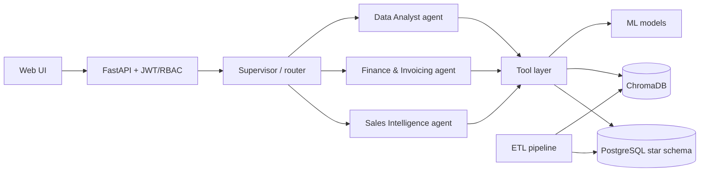

# AXIS

**A multi-agent AI platform that gives SMEs natural-language access to their CRM, invoicing, and analytics data, running fully on local hardware.**

Built as my end-of-studies project (PFE) during a four-month internship at EITA Innov, Tunisia.

Ask *"which deals are most likely to close this quarter?"* or *"show unpaid invoices by client as a chart"* and AXIS routes the question to the right specialist agent, queries the data warehouse, and answers with text, tables, or Plotly charts.

<!-- Add a screenshot or demo GIF here:  -->

---

## Why this exists

Most SME staff can't write SQL, and most "chat with your data" demos fall apart on real, messy business data. AXIS is built around two constraints:

1. **Data stays on-premise.** Inference runs locally through Ollama (Qwen2.5 7B on a single RTX 4060). No client data leaves the machine.
2. **A small model has to be reliable, not just impressive.** A 7B model hallucinates tool calls, over-generalizes negative instructions, and breaks on large schemas. Instead of hiding that, the system is designed around it (see [Reliability layer](#reliability-layer)).

## Architecture



### Agents

| Agent | Responsibility |
|---|---|
| **Sales Intelligence** | Pipeline, companies, contacts, deals, churn risk and win-probability insights |
| **Finance & Invoicing** | Invoices, payments, receivables, billing queries |
| **Data Analyst** | Cross-domain analytics and chart generation |
| **Supervisor** | Classifies each request and routes it to the right agent |

Agents can also be loaded dynamically at runtime (`backend/agents/dynamic_loader.py`, `backend/routes/dynamic_agents.py`) and are checked by a validator (`backend/agents/meta_validator.py`) before use.

### Data layer

- **PostgreSQL 16** with a **Kimball star schema** (facts and dimensions) for analytics queries.
- **14-step ETL pipeline** (`backend/etl/etl_pipeline.py`) with **two-pass canonicalization**: rule-based normalization first, then fuzzy matching (`rapidfuzz`, 85% threshold) to deduplicate company and client names across CRM and invoicing sources.
- **RAG** over two ChromaDB collections (CRM and invoicing), roughly **159K vectors**, embedded with `nomic-embed-text`.

### ML models

| Model | Task | Notes |
|---|---|---|
| Random Forest | Deal win prediction | AUC ≈ 0.96 |
| Logistic Regression | Customer churn detection | AUC ≈ 0.80 |

Both are wrapped in `CalibratedClassifierCV`, so the probabilities the agents quote are actually calibrated rather than raw scores. An LLM-written deal summary is produced on top of the prediction (`backend/ml/deal_summarizer.py`).

### Reliability layer

Four mechanisms compensate for the limits of a small local LLM:

1. **Deterministic bypass.** Common, well-understood intents skip the LLM planner entirely and go straight to the right tool.
2. **Retry wrapper.** Malformed tool calls are caught and retried with a corrective prompt.
3. **Raw JSON interception.** When the model emits tool output instead of a final answer, it's intercepted and turned into a proper response (`tool_interceptor.py`).
4. **Schema reduction.** The database schema passed to the model is trimmed from about 41 KB to about 10 KB per request, which keeps the 7B model inside a usable context budget.

The trade-off is deliberate: more deterministic routing means less "free" agentic behavior, in exchange for predictable results on constrained hardware.

## Tech stack

Python 3.11 · FastAPI · LangChain · Ollama (Qwen2.5 7B, nomic-embed-text) · PostgreSQL 16 · ChromaDB · scikit-learn · Apache Airflow · Docker Compose · JWT/bcrypt auth with role-based access · vanilla JS + Plotly.js

## Getting started

### Prerequisites

- Docker and Docker Compose
- [Ollama](https://ollama.com) installed and running
- A GPU with ~8 GB VRAM is recommended (developed on an RTX 4060)

### 1. Pull the models

```bash
ollama pull qwen2.5:7b
ollama pull nomic-embed-text
```

### 2. Configure environment

```bash
cp .env.template .env
# Fill in the values (database credentials, JWT secret, Ollama URL)
```

### 3. Start the stack

```bash
docker-compose up --build
```

### 4. Seed the demo data

```bash
docker-compose exec api python -m backend.seed.seed_jbm
```

### 5. Open the app

Go to the address your FastAPI container exposes (by default `http://localhost:8000`) and sign in with one of the seeded demo users. The seed script prints the accounts it creates.

### Running without Docker

```bash
python -m venv venv
venv\Scripts\activate        # Windows
pip install -r requirements.txt
uvicorn backend.main:app
```

Point `DATABASE_URL` in `.env` at a local PostgreSQL 16 instance first. When iterating on agent prompts, restart the server fully instead of using `--reload`: cached agent executors can keep serving stale system prompts.

## Example queries

- "Which open deals are most likely to close, and why?"
- "Which customers show the highest churn risk?"
- "Show unpaid invoices by client as a bar chart."
- "Summarize the history of our relationship with <company>."
- "Compare revenue by sector over the last four quarters."

## Project structure

```
backend/
  agents/     supervisor, specialist agents, dynamic loader, validator
  etl/        14-step ETL pipeline and canonicalization
  ml/         deal predictor, churn model, recommendations, summarizer
  models/     warehouse (star schema) models
  routes/     API routes
  seed/       demo data seeding
  tools/      CRM, invoicing, and chart tools used by the agents
data/         staging data for the ETL
static/       web UI and guided tour
```

## Security notes

- Passwords are hashed with bcrypt; sessions use JWT with role-based access control.
- Never commit `.env`. Only `.env.template` is tracked.
- The demo dataset is for development only. Do not reuse the seeded credentials anywhere real.

## Author

**Jihed**, software engineering student.
AXIS was built as my end-of-studies project (PFE) for my Business Computing (Business Intelligence) degree at ISG Tunis, during a four-month internship at EITA Innov, Tunisia.
